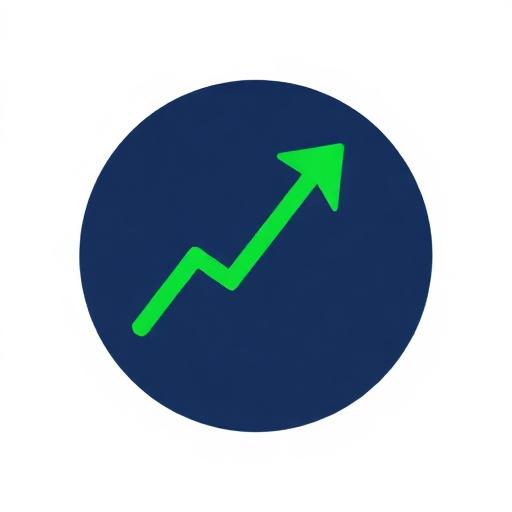
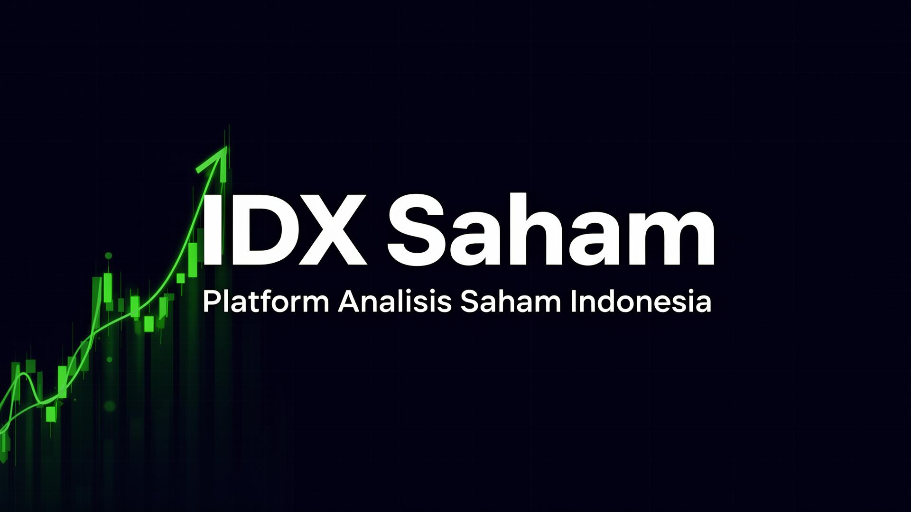

<p align="center">
  
</p>

<h1 align="center">IDX Saham</h1>

<p align="center">
  <strong>Platform Analisis Saham Indonesia</strong><br/>
  Pantau pergerakan IHSG, analisis fundamental & teknikal, screening cerdas — semua dalam satu dashboard modern.
</p>

<p align="center">
  
  
  
  
  
  
</p>

<p align="center">
  
</p>

---

## ✨ Fitur Utama

| Fitur | Deskripsi |
|-------|-----------|
| 📊 **Market Overview** | Pantau indeks utama — IHSG, LQ45, IDX30, JII — dengan ringkasan pasar harian |
| 🔥 **Top Movers** | Saham dengan kenaikan & penurunan terbesar hari ini (gainers & losers) |
| 🏆 **Most Active** | Saham dengan volume perdagangan tertinggi di pasar |
| 🗺️ **Heat Map** | Visualisasi sektor pasar berdasarkan market cap relatif dengan warna dinamis |
| 🔍 **Stock Screening** | Filter saham berdasarkan kategori, valuasi, verdict, kepatuhan Syariah, dan ticker |
| 📈 **Stock Detail** | Analisis mendalam: chart interaktif, indikator teknikal, price targets, berita terkait |
| ⚖️ **Stock Compare** | Bandingkan hingga 4 saham secara berdampingan dengan radar chart |
| 🎯 **Signal Badge** | Sinyal otomatis BUY / HOLD / SELL berdasarkan skor fundamental |
| 🌙 **Dark & Light Mode** | Tema gelap dan terang yang bisa ditoggle sesuai preferensi |
| 📱 **Responsive** | Tampilan optimal di desktop, tablet, dan mobile |

---

## 🔍 Fitur Screening (Detail)

Fitur screening memungkinkan penyaringan saham secara mendalam:

### Filter yang Tersedia
- **Kategori:** Semua, Blue Chip, High Dividend, Growth, Value
- **Valuasi:** All, Undervalued, Fair Value, Overvalued
- **Verdict:** All Verdicts, Strong Buy, Buy, Hold, Sell, Strong Sell
- **Syariah:** Toggle filter saham yang sesuai prinsip syariah
- **Ticker:** Klik ticker chips untuk toggle aktif/non-aktif

### Informasi per Kartu Screening
- **Verdict Badge** — warna-coded (Strong Buy = hijau, Hold = kuning, Sell = merah)
- **Harga & Perubahan** — last close price dengan persentase perubahan
- **Signal Chips** — sinyal 1W, 1M, 3M+ dengan warna hijau/merah/netral
- **Price Targets** — 3 level: Conservative, Moderate, Aggressive + persentase upside
- **Indikator Teknikal** — RSI (14), RSI (12), MACD, Volume Ratio

---

## 📈 Halaman Detail Saham

Setiap saham memiliki halaman detail lengkap:

| Section | Konten |
|---------|--------|
| **Hero** | Ticker, nama, harga, perubahan %, signal badge (BUY/HOLD/SELL) |
| **Chart** | Grafik harga interaktif dengan pilihan periode (1M, 3M, 6M, 1Y) |
| **Price Targets** | Target harga Conservative, Moderate, Aggressive |
| **Key Indicators** | Mini cards RSI, MACD, Volume Ratio di sidebar |
| **Peer Comparison** | Perbandingan dengan saham sejenis di sektor yang sama |
| **Technical Analysis** | Indikator teknikal lengkap |
| **Berita** | Berita terkait saham dengan sentimen positif/negatif/netral |

---

## 🛠️ Tech Stack

| Kategori | Teknologi |
|----------|-----------|
| **Framework** | [React 18](https://react.dev) + [TypeScript](https://typescriptlang.org) |
| **Build Tool** | [Vite 5](https://vitejs.dev) |
| **Styling** | [Tailwind CSS](https://tailwindcss.com) + [shadcn/ui](https://ui.shadcn.com) |
| **Charts** | [Recharts](https://recharts.org) |
| **Animations** | [Framer Motion](https://www.framer.com/motion) |
| **Icons** | [Lucide React](https://lucide.dev) |
| **Routing** | [React Router v6](https://reactrouter.com) |
| **State Management** | [TanStack React Query](https://tanstack.com/query) |
| **Form Handling** | [React Hook Form](https://react-hook-form.com) + [Zod](https://zod.dev) |
| **Theme** | [next-themes](https://github.com/pacocoursey/next-themes) |

---

## 🚀 Getting Started

### Prasyarat
- [Node.js](https://nodejs.org) v18+ atau [Bun](https://bun.sh)
- npm, yarn, atau bun sebagai package manager

### Instalasi

```bash
# Clone repository
git clone <repo-url>
cd idx-saham

# Install dependencies
npm install
# atau
bun install

# Jalankan development server
npm run dev
# atau
bun run dev
```

Buka [http://localhost:5173](http://localhost:5173) di browser.

### Build untuk Production

```bash
npm run build
npm run preview
```

---

## 📁 Struktur Proyek

```
idx-saham/
├── public/
│   ├── favicon.png          # App favicon
│   ├── og-image.png         # Social media preview image
│   └── robots.txt           # SEO robots file
├── src/
│   ├── components/
│   │   ├── ui/              # shadcn/ui base components (Button, Card, Dialog, dll)
│   │   ├── StockCard.tsx     # Kartu saham dengan sparkline & signal badge
│   │   ├── StockScreener.tsx # Fitur screening lengkap dengan filter & result cards
│   │   ├── StockChart.tsx    # Chart harga saham interaktif (Recharts)
│   │   ├── StockCompare.tsx  # Perbandingan multi-saham side-by-side
│   │   ├── StockTable.tsx    # Tabel data saham sortable
│   │   ├── HeatMap.tsx       # Peta panas sektor berdasarkan market cap
│   │   ├── TopMovers.tsx     # Top gainers & losers hari ini
│   │   ├── MostActive.tsx    # Saham paling aktif berdasarkan volume
│   │   ├── MarketOverview.tsx # Ringkasan indeks pasar (IHSG, LQ45, dll)
│   │   ├── MarketSentiment.tsx # Gauge sentimen pasar
│   │   ├── MarketSummary.tsx  # Summary statistik pasar
│   │   ├── MarketTicker.tsx   # Ticker tape berjalan
│   │   ├── SectorChart.tsx    # Pie chart sektor
│   │   ├── SectorDetail.tsx   # Detail breakdown per sektor
│   │   ├── SearchBar.tsx      # Search saham dengan autocomplete
│   │   ├── Sparkline.tsx      # Mini chart sparkline per kartu
│   │   ├── PeerComparison.tsx # Perbandingan peer di sektor sama
│   │   ├── RadarCompare.tsx   # Radar chart perbandingan metrik
│   │   ├── TechnicalAnalysis.tsx # Indikator teknikal detail
│   │   ├── StockNewsList.tsx  # Daftar berita terkait saham
│   │   ├── AnimatedCounter.tsx # Counter animasi angka
│   │   ├── Footer.tsx         # Footer aplikasi
│   │   ├── MobileNav.tsx      # Navigasi mobile responsive
│   │   ├── NavLink.tsx        # Link navigasi dengan active state
│   │   ├── TabSkeletons.tsx   # Loading skeletons untuk setiap tab
│   │   └── ThemeProvider.tsx  # Provider tema dark/light
│   ├── data/
│   │   └── stockData.ts      # Data saham, indeks, helper functions
│   ├── pages/
│   │   ├── Index.tsx          # Halaman utama (dashboard dengan tabs)
│   │   ├── StockDetail.tsx    # Halaman detail per saham
│   │   └── NotFound.tsx       # Halaman 404
│   ├── hooks/
│   │   ├── use-mobile.tsx     # Hook deteksi mobile viewport
│   │   └── use-toast.ts      # Hook notifikasi toast
│   ├── lib/
│   │   └── utils.ts          # Utility functions (cn, dll)
│   ├── App.tsx                # Root component dengan routing
│   ├── main.tsx               # Entry point aplikasi
│   └── index.css              # Global styles & design tokens
├── index.html                 # HTML template dengan SEO meta tags
├── tailwind.config.ts         # Konfigurasi Tailwind + custom colors
├── vite.config.ts             # Konfigurasi Vite
├── tsconfig.json              # TypeScript config
└── components.json            # shadcn/ui config
```

---

## 🎨 Design System

Proyek ini menggunakan design system berbasis **CSS custom properties** (HSL) dengan dukungan dark/light mode:

### Tokens Utama
| Token | Fungsi |
|-------|--------|
| `--background` | Warna latar belakang utama |
| `--foreground` | Warna teks utama |
| `--primary` | Warna aksen utama (tombol, link aktif) |
| `--secondary` | Warna sekunder (badge, chip) |
| `--muted` | Warna elemen non-aktif |
| `--accent` | Warna hover & highlight |
| `--gain` | Hijau — kenaikan harga |
| `--loss` | Merah — penurunan harga |
| `--card` | Warna background kartu |
| `--border` | Warna border elemen |

### Penggunaan
```tsx
// ✅ Gunakan semantic token
<div className="bg-card text-foreground border-border" />
<span className="text-gain">+1.28%</span>

// ❌ Jangan hardcode warna
<div className="bg-[#1a1a2e] text-white" />
```

---

## 📊 Data

Saat ini menggunakan **data statis** (mock data) yang didefinisikan di `src/data/stockData.ts`. Data mencakup:

- **14 saham** dari berbagai sektor (Keuangan, Teknologi, Konsumsi, Ritel, dll)
- **4 indeks pasar** — IHSG, LQ45, IDX30, JII
- **Berita** per saham dengan sentimen
- **Helper functions** — `generateChartData()`, `generateSparkline()`, `formatRupiah()`, `formatVolume()`

> 💡 Untuk integrasi data real-time, bisa dihubungkan dengan API seperti Yahoo Finance, IDX API, atau provider data pasar lainnya.

---

## 📝 Lisensi

MIT License — bebas digunakan untuk keperluan pribadi maupun komersial.

---

<p align="center">
  Dibuat dengan ❤️ menggunakan <a href="https://lovable.dev">Lovable</a>
</p>
